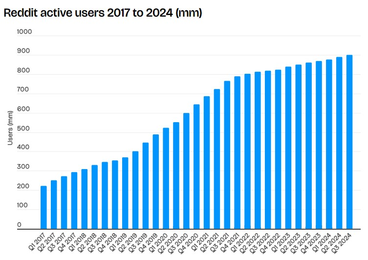
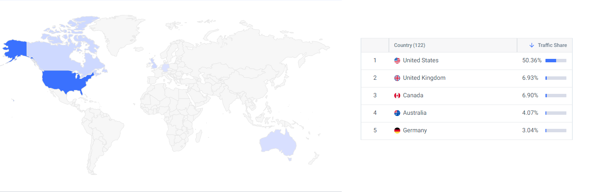
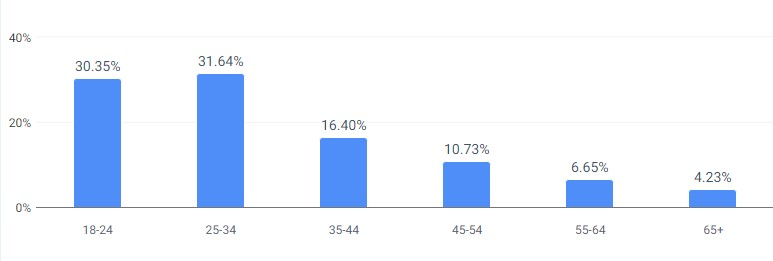
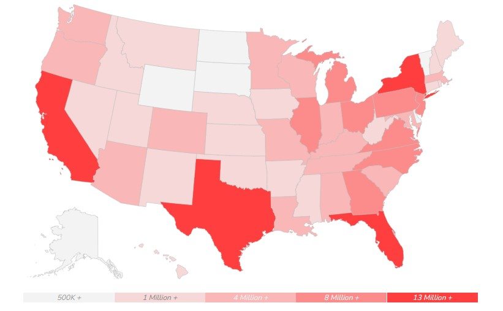
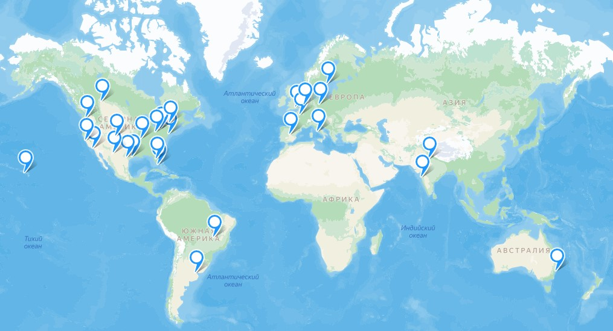

# HighLoad 
Репозиторий курсовой работы по высоконагруженным системам от VK Education (ex. Технопарк)

---

- [HighLoad](#highload)
- [1. Тема и целевая аудитория](#1-тема-и-целевая-аудитория)
- [2. Расчет нагрузки](#2-расчет-нагрузки)
  - [Продуктовые метрики](#продуктовые-метрики)
      - [Среднее количество действий пользователя в день](#среднее-количество-действий-пользователя-в-день)
      - [Средний размер хранилища пользователя](#средний-размер-хранилища-пользователя)
  - [Технические метрики](#технические-метрики)
      - [Размер хранилища](#размер-хранилища)
      - [Сетевой трафик](#сетевой-трафик)
      - [RPS](#rps)
- [3. Глобальная балансировка нагрузки](#3-глобальная-балансировка-нагрузки)
      - [Разбиение по доменам](#разбиение-по-доменам)
      - [Расположение датацентров](#расположение-датацентров)
      - [Расчет распределения запросов](#расчет-распределения-запросов)
      - [Схема DNS-балансировки](#схема-dns-балансировки)
- [Список использованных источников](#список-использованных-источников)
---

# 1. Тема и целевая аудитория
**Reddit** — это крупнейшая социальная платформа и агрегатор новостей, контента и дискуссий, основанная на пользовательских сообществах.

* Число активных пользователей

  -  MAU на 3 квартал 2024: 901 млн. Динамика изменения MAU с 2017 до 2024[^1]: 
  

  - DAU на 2023: 70 млн. Динамика изменения DAU c 2019 до 2024[^2]: 
    | Год | DAU (млн) |
    |------|----------|
    | 2019| 36        |
    | 2020| 52        |
    | 2021| 50        |
    | 2022| 57        |
    | 2023| 70        |
    | 2024| 101[^7]   |

* Целевая аудитория[^3]
  
  - По странам:
  
    | Страна | MAU (млн) |
    |---------------|-----------|
    | США           | 453       |
    | Великобритания| 63        |
    | Канада        | 62        |
    | Автсралия     | 36        |
    | Германия      | 27        |
  
  - По возрасту:

     

  - По полу:
 
     

* Требования к функционалу
  - MVP:
    - Регистрация и авторизация
    - Создание и управление сообществами
    - Подписка на сообщества
    - Публикация и редактирование постов
    - Комментарии к постам
    - Система голосования (upvote/downvote)
    - Рекомендательная лента 
    - Чат

---
# 2. Расчет нагрузки

## Продуктовые метрики

| Метриика       | Значение  |
|--------------- |-----------|
| MAU            | 860 млн   |
| DAU            | 101 млн   |

#### Среднее количество действий пользователя в день
  - В среднем пользователь подписан на 15 сабреддитов [^4]. Новые пользователи, как правило, подписываются на несколько сабреддитов сразу    после регистрации. В 2024 зарегистрировалось 30.2 млн новых пользователей[^5], следоватлеьно в месяц 30.2:12 = 2.52  млн новых пользователей. Предположим, что новый пользователь подписывается сразу на 10 сабреддитов, тогда 2.52 * 10 = 25.2 млн подписок в месяц от новых пользователей. Число существующих (не новых) пользователей в месяц 860 - 25.2 = 834.8 млн. Предположим, что 10% этих пользователей добавляют 1 новую подписку в месяц, тогда это ещё 834.8 * 0.1 * 1 = 83.48 млн подписок в месяц. Таким образом, общее число подписок на сабреддиты в месяц составляет 25.2 + 83.48 = 108.68 млн. Тогда один пользователь в день совершает 108.68:30:101=0.04 подписок.
  - В 2022 году было опубликовано 492.3 млн постов [^4]. Допустим в 2024 число такое же, тогда в день 492.3:365 = 1.35 млн постов, следовательно один пользователь создает 1.35 : 101 = 0.01 пост в день.

  - В 2022 году было оставлено 2.72 млрд комментариев [^8]. Так же допускаем, что в 2024 году число осталось тем же, тогда в день 2720 : 365 = 7.45 млн комментариев, а один пользователь оставляет 7.45: 101 = 0.07 комментария в день.

  - Количество голосов, оставленных пользователями, не разглашается, поэтому, предположим, что каждый пользователь оставляет по 5 голосов в день.

  - Средняя продолжительность сессии пользователя составляет 12.38 минут [^9], предположим, что за день пользователь проводит 3 сессии и среднем тратит 0.5 минуты на пост, тогда среднее число просмотренных постов в день составляет 12.38*3:0.5 = 74.28. 

  - Среднее количество сообщений, отправляемых ежемесячно, составляет 2.61 млдр [^10], соотвественно в день 2610:30=87 млн. Тогда каждый пользователь отправляет 87:101 = 0.86 сообщений ежедневно.
  
    | Действие                     | Количество |
    |------------------------------|------------|
    | Подписка на сабреддит        | 0.04       |
    | Публикация постов            | 0.01       |
    | Написание комментариев       | 0.07       |
    | Оценка постов и комментариев | 5          |
    | Просмотр постов              | 74.28      |
    | Отправка сообщений        | 0.86       |

#### Средний размер хранилища пользователя
  - Для хранения одной подписки требуется около 30 байт. В среднем у пользователя 20 подписок на сабреддиты, значит общий объем памяти, необходимый для их хранения 30 * 20 = 600  байт  = 0.0006  МБ.
  - Посты:
    - Медиа данные:
      - В 35% опубликованных постов содержатся изображения, средний размер которых составляет 350 КБ = 0.34 МБ (для изображения 1920х1080).
      - В 15% опубликованных постов содержится видео, средняя продолжительность которого составляет 38 секунд. Одна секунда видео в разрешении 720p занимает примерно 3 Мбит, следовательно полное видео будет занимать 38 * 3 = 114 Мбит  = 14.25 МБ.
    - Текстовые данные
      - В каждом посте есть заголовок, средняя длина которого составляет 50 символов, в кодировке utf-8 один символ может занимать от 1 до 4 байтов, предположим, что средний размер одного символа равен 2 байтам. Тогда размер заголовка будет составлять 50 * 2 = 100 Б = 0.0001 МБ
      - В 80% опубликованных постов есть текстовое описание, средняя длина которого составляет 900 символов, каждый из которых кодируется 2 байтами. Тогда размер описания будет составлять 900 * 2 = 1800 Б = 0.002 МБ
    - Общий размер поста будет составлять 0.34 * 0.35 + 14.25 * 0.15 + 0.0001 + 0.002 * 0.8 = 2.26 МБ. В среднем каждый пользователь имеет 5 опубликованных постов, значит объем памяти, необходимый для их хранения, составляет 2.26 * 5 = 11.3 МБ.
  - Средняя длина комментария составляет 100 символов, каждый из которых кодируется 2 байтами. Тогда размер комментария будет составлять 100 * 2 = 200 Б = 0.0002 МБ. В среднем каждый пользователь имеет 35 комментариев, значит объем памяти, необходимый для их хранения, составляет 0.0002 * 35 = 0.007 МБ.
  - Для хранения одного голоса требуется около 31 байт. В среднем у пользователя 1000 голосов, общий объем памяти, необходимый для их хранения 31 * 1000 = 3100  байт  = 0.031  МБ.
  - Для медиа данных сообщений возьмем те же рассчеты, что и для поста. Средний размер текста сообщения равен 100 символам, что занимают 0.0002 МБ, как было показано ранее. Тогда общий размер сообщения равен 0.34 * 0.35 + 14.25 * 0.15 + 0.0002 = 2.26 МБ. В среднем у пользователя есть 430 сообщений, тогда общий объем памяти, необходимый для их хранения 2.26 * 430 = 971.8  МБ.

| Тип | Количество | Размер, МБ |
|-----|------------|--------|
|Подписки | 20 | 0.0006 |
| Посты | 5 | 11.3 |
| Комментарии| 35 | 0.007 |
| Голоса | 1000 | 0.031 |
| Сообщения | 430 | 971.8 |
| Итого | 1490 | 983.1386 |

## Технические метрики

#### Размер хранилища 
  - Общее число всех подписок неизвестно, поэтому посчитаем его исходя из общего количества зарегистрированных пользователей, равного 1.72 млрд, и предположения, сделанного ранее, что у среднего пользователя объем памяти, необходимый для хранения подписок, равен 0.0006 МБ. Тогда 1720 * 0.0006 = 1.3 млн МБ =0.001 ПБ.
  - Аналогично предыдущему пункту для постов получим 1720 * 11.3 = 19436 млн МБ = 18.1 ПБ.
  - Для комментариев 1720 * 0.007 = 12.04 млн МБ = 0.011 ПБ.
  - Для голосов 1720 * 0.031 = 53.32 млн МБ = 0.049 ПБ.
  - Для сообщений 1720 * 971.8 = 1671496 млн МБ = 1555.75 ПБ.

    | Тип                  | Размер, ПБ           |
    |----------------------|----------------------|
    | Подписки             | 0.001                |
    | Посты                | 18.1                 |
    | Комментарии          | 0.011                |
    | Голоса               | 0.049                |
    | Сообщения            | 1555.75              |
    | Итого                | 1573                 |

#### Сетевой трафик
  Формула: Среднее потребление = Трафик на действие * RPS  
           Пиковое потребление = 1.4 * Среднее потребление  
           Суммарный суточный трафик = Трафик на действие * Количество запросов в день от одного пользователя * DAU

- **Подписка на сабреддит**:
  - Среднее потребление:
    1.8 КБ * 46.76 ≈ 84.168 Кбит/с ≈ 0.084 Гбит/с
  - Пиковое потребление:
    1.4 * 0.084 ≈ 0.118 Гбит/с
  - Суммарный суточный трафик:
    1.8 КБ * 0.04 * 101,000,000 ≈ 7,272,000 КБ ≈ 7,272 ГБ

- **Публикация постов**:
  - Среднее потребление:
    28.8 КБ * 11.69 ≈ 336.672 Кбит/с ≈ 0.337 Гбит/с
  - Пиковое потребление:
    1.4 * 0.337 ≈ 0.472 Гбит/с
  - Суммарный суточный трафик:
    28.8 КБ * 0.01 * 101,000,000 ≈ 28,800,000 КБ ≈ 28,800 ГБ

- **Написание комментариев**:
  - Среднее потребление:
    5.5 КБ * 81.83 ≈ 450.065 Кбит/с ≈ 0.450 Гбит/с
  - Пиковое потребление:
    1.4 * 0.450 ≈ 0.630 Гбит/с
  - Суммарный суточный трафик:
    5.5 КБ * 0.07 * 101,000,000 ≈ 38,885,000 КБ ≈ 38,885 ГБ

- **Оценка постов и комментариев**:
  - Среднее потребление:
    2.5 КБ * 5,844.91 ≈ 14,612.275 Кбит/с ≈ 14.612 Гбит/с
  - Пиковое потребление:
    1.4 * 14.612 ≈ 20.457 Гбит/с
  - Суммарный суточный трафик:
    2.5 КБ * 5 * 101,000,000 ≈ 1,262,500,000 КБ ≈ 1,262,500 ГБ

- **Просмотр постов**:
  - Среднее потребление:
    1.6 КБ * 86,834.72 ≈ 138,935.552 Кбит/с ≈ 138.936 Гбит/с
  - Пиковое потребление:
    1.4 * 138.936 ≈ 194.510 Гбит/с
  - Суммарный суточный трафик:
    1.6 КБ * 74.28 * 101,000,000 ≈ 11,988,480,000 КБ ≈ 11,988,480 ГБ

- **Отправка сообщений**:
  - Среднее потребление:
    0.916 КБ * 1,005.32 ≈ 920.873 Кбит/с ≈ 0.921 Гбит/с
  - Пиковое потребление:
    1.4 * 0.921 ≈ 1.289 Гбит/с
  - Суммарный суточный трафик:
    0.916 КБ * 0.86 * 101,000,000 ≈ 79,676,560 КБ ≈ 79,677 ГБ

  | Действие                     | Трафик на действие | Среднее потребление, Гбит/с | Пиковое потребление, Гбит/с | Суммарный суточный трафик, ГБ |
  |------------------------------|--------------------|-----------------------------|-----------------------------|-------------------------------|
  | Подписка на сабреддит        | 1.8 КБ             | 0.084                       | 0.118                       | 7,272                         |
  | Публикация постов            | 28.8 КБ            | 0.337                       | 0.472                       | 28,800                        |
  | Написание комментариев       | 5.5 КБ             | 0.450                       | 0.630                       | 38,885                        |
  | Оценка постов и комментариев | 2.5 КБ             | 14.612                      | 20.457                      | 1,262,500                     |
  | Просмотр постов              | 1.6 КБ             | 138.936                     | 194.510                     | 11,988,480                    |
  | Отправка сообщений           | 0.916 КБ           | 0.921                       | 1.289                       | 79,677                        |

#### RPS
  Формула: RPS = (Количество запросов в день от одного пользователя * DAU) / 86400 секунд  
           Пиковое RPS = 1.4 * RPS

  - Подписка на сабреддит:
    - RPS = (0.04 * 101,000,000) / 86,400 ≈ 46.76
    - Пиковое RPS: 46.76 * 1.4 ≈ 65.46

  - Публикация постов:
    - RPS = (0.01 * 101,000,000) / 86,400 ≈ 11.69
    - Пиковое RPS: 11.69 * 1.4 ≈ 16.37

  - Написание комментариев:
    - RPS = (0.07 * 101,000,000) / 86,400 ≈ 81.83
    - Пиковое RPS: 81.83 * 1.4 ≈ 114.56

  - Оценка постов и комментариев:
    - RPS = (5 * 101,000,000) / 86,400 ≈ 5,844.91
    - Пиковое RPS: 5,844.91 * 1.4 ≈ 8,182.87

  - Просмотр постов:
    - RPS = (74.28 * 101,000,000) / 86,400 ≈ 86,834.72
    - Пиковое RPS: 86,834.72 * 1.4 ≈ 121,568.61

  - Отправка сообщений:
    - RPS = (0.86 * 101,000,000) / 86,400 ≈ 1,005.32
    - Пиковое RPS: 1,005.32 * 1.4 ≈ 1,407.45

  | Тип запроса                  | Среднее RPS | Пиковое RPS |
  |----------------------------------|-----------------|-----------------|
  | Подписка на сабреддит           | 46.76           | 65.46           |
  | Публикация постов               | 11.69           | 16.37           |
  | Написание комментариев          | 81.83           | 114.56          |
  | Оценка постов и комментариев    | 5844.91         | 8182.87         |
  | Просмотр постов                 | 86834.72        | 121568.61       |
  | Отправка сообщений              | 1005.32         | 1407.45         |
  | Итого                           | 93825.23        | 131355.32       |

---
# 3. Глобальная балансировка нагрузки

#### Разбиение по доменам

- www.reddit.com — основной домен, где находится основная часть контента
- m.reddit.com — мобильная версия сайта
- mod.reddit.com — инструменты для модераторов
- api.reddit.com — API для разработчиков.
- oauth.reddit.com — используется для OAuth-аутентификации.

#### Расположение датацентров
Чуть больше половины пользователей reddit (57.23%) находятся в северной америке [^11], следовательно большая часть ДЦ будет располагаться там. Также большое количество пользователей (~20.14%) располагаются в Европе, а именно в Великобритании, Германии, Франции, Швеции, Испании, Нидерландах, Италии [^11]. Еще заметное число пользователей (5.18%) находятся в Индии. В Австралии располагается 3.54% пользоватлей. В южной америке, а именно в Бразилии и Аргентине, находится 4.75% пользоватлей [^11].

Так как большинство пользователей находятся в США, проведем анализ численности населения по штатам [^12]:

 

Самые густонасленные штаты:
- Калифорния - 39.5 млн
- Техас - 28.7 млн
- Флорида - 21.3 млн
- Нью-Йорк - 19.5 млн

Для них стоит расположить ДЦ в самых населенных городах. Для менее густонаселенных участков расположим один ДЦ на несколько штатов. Таким образом спсиок городов с ДЦ в США будет иметь вид:
- Лос-анджелес
- Сан-франциско
- Хьюстон
- Сан-Антонио
- Сьюдад-Хуарес
- Маями
- Орландо
- Нью-Йорк
- Баффало
- Гонолулу
- Кливленд
- Денвер
- Сиэтл
- Сент-Луис

Для остальных стран расположим по 1-2 ДЦ в самых густонаселенных городах:
- Монреаль
- Эдмонтон
- Лондон
- Берлин
- Париж 
- Стокгольм
- Мадрид
- Амстердам
- Рим
- Нью Дели
- Мумбаи
- Сидней
- Бразилиа
- Буэнос-Айрес

 

*Интерактивная карта: https://yandex.ru/maps/?um=constructor%3Abf2ab49a37b44b80fba2b2012349a15d68757823babed98b1eb5aec839e83e00&source=constructorLink*

#### Расчет распределения запросов
Формула: Средний RPS * % всех пользователей
| Регион       | % всех пользователей | Подписка на сабреддит | Публикация постов | Написание комментариев | Оценка постов и комментариев | Просмотр постов | Отправка сообщений |
|--------------|----------------------|------------------------|--------------------|-------------------------|-----------------------------|-----------------|---------------------|
| США          | 50.36                | 23.55                 | 5.89               | 41.21                  | 2943.74                     | 43735.58        | 506.28              |
| Великобританя| 6.93                 | 3.24                  | 0.81               | 5.67                   | 404.85                      | 6017.64         | 69.63               |
| Канада       | 6.9                  | 3.23                  | 0.81               | 5.65                   | 403.30                      | 5991.59         | 69.37               |
| Индия        | 5.18                 | 2.42                  | 0.61               | 4.24                   | 302.77                      | 4498.04         | 52.08               |
| Австралия    | 4.07                 | 1.90                  | 0.48               | 3.33                   | 237.89                      | 3534.17         | 40.92               |
| Германия     | 3.04                 | 1.42                  | 0.36               | 2.49                   | 177.69                      | 2639.78         | 30.56               |
| Франция      | 2.97                 | 1.39                  | 0.35               | 2.43                   | 173.59                      | 2578.99         | 29.86               |
| Бразилия     | 2.62                 | 1.23                  | 0.31               | 2.14                   | 153.14                      | 2275.07         | 26.34               |
| Нидерланды   | 2.55                 | 1.19                  | 0.30               | 2.09                   | 149.05                      | 2214.28         | 25.64               |
| Швеция       | 2.05                 | 0.96                  | 0.24               | 1.68                   | 119.82                      | 1780.11         | 20.61               |
| Испания      | 1.99                 | 0.93                  | 0.23               | 1.63                   | 116.31                      | 1728.01         | 20.01               |
| Италия       | 1.88                 | 0.88                  | 0.22               | 1.54                   | 109.88                      | 1632.09         | 18.90               |
| Аргентина    | 1.03                 | 0.48                  | 0.12               | 0.84                   | 60.20                       | 894.40          | 10.35               |

#### Схема DNS-балансировки
Ввиду масштаба и требования к высокой доступности, производительности и отказоустойчивости для reddit можно применить **Geo-based DNS**, который должен обеспечить направление пользователя на ближаший ДЦ. Однако данный метод не может гарантировать минимальную задержку, так как не учитывает загруженность ДЦ. Для решения этой проблемы можно использовать **Latency-based DNS**, который отправляет пользователя на ДЦ с минимальной задержкой.
# Список использованных источников
[^1]: https://www.businessofapps.com/data/reddit-statistics/
[^2]: https://jobera.com/reddit-statistics/
[^3]: https://www.similarweb.com/website/reddit.com/
[^4]: https://www.demandsage.com/reddit-statistics/
[^5]: https://www.statista.com/forecasts/1143622/reddit-users-in-the-world
[^7]: https://redditinc.com/press
[^8]: https://www.statista.com/forecasts/1309805/reddit-users-comments-votes
[^9]: https://www.semrush.com/website/reddit.com/overview/
[^10]: https://passport-photo.online/blog/reddit-statistics/
[^11]: https://worldpopulationreview.com/country-rankings/reddit-users-by-country
[^12]: https://nottio.com