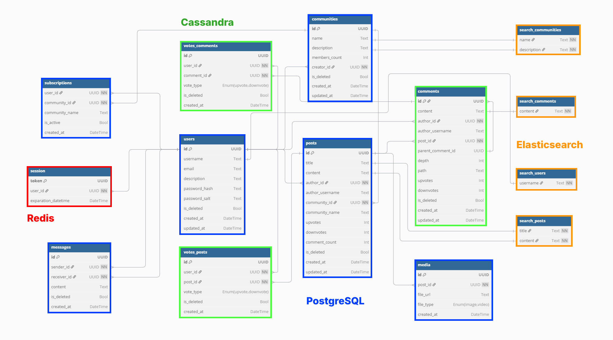

# HighLoad 
Репозиторий курсовой работы по высоконагруженным системам от VK Education (ex. Технопарк)

---
- [HighLoad](#highload)
- [1. Тема и целевая аудитория](#1-тема-и-целевая-аудитория)
- [2. Расчет нагрузки](#2-расчет-нагрузки)
  - [Продуктовые метрики](#продуктовые-метрики)
      - [Среднее количество действий пользователя в день](#среднее-количество-действий-пользователя-в-день)
      - [Средний размер хранилища пользователя](#средний-размер-хранилища-пользователя)
    - [Рост объема хранилища ежегодно](#рост-объема-хранилища-ежегодно)
  - [Технические метрики](#технические-метрики)
      - [Размер хранилища](#размер-хранилища)
      - [Сетевой трафик](#сетевой-трафик)
      - [RPS](#rps)
- [3. Глобальная балансировка нагрузки](#3-глобальная-балансировка-нагрузки)
    - [Разбиение по доменам](#разбиение-по-доменам)
    - [Расположение датацентров](#расположение-датацентров)
    - [Расчет распределения запросов](#расчет-распределения-запросов)
    - [Схема DNS-балансировки](#схема-dns-балансировки)
- [4. Локальная балансировка нагрузки](#4-локальная-балансировка-нагрузки)
    - [Cхемы балансировки для входящих и межсервисных запросов](#cхемы-балансировки-для-входящих-и-межсервисных-запросов)
    - [Cхема отказоустойчивости](#cхема-отказоустойчивости)
    - [Нагрузка по терминации SSL](#нагрузка-по-терминации-ssl)
- [5. Логическая схема БД](#5-логическая-схема-бд)
    - [Схема](#схема)
    - [Размеры данных и консистентность](#размеры-данных-и-консистентность)
    - [Нагрузка на чтение/запись](#нагрузка-на-чтениезапись)
- [6. Физическая схема БД](#6-физическая-схема-бд)
    - [Схема](#схема-1)
    - [Индексы](#индексы)
    - [Денормализация](#денормализация)
    - [Выбор СУБД](#выбор-субд)
    - [Шардирование и резервирование СУБД](#шардирование-и-резервирование-субд)
    - [Клиентские библиотеки / интеграции](#клиентские-библиотеки--интеграции)
    - [Балансировка запросов / мультиплексирование подключений](#балансировка-запросов--мультиплексирование-подключений)
    - [Схема резервного копирования](#схема-резервного-копирования)
- [Список использованных источников](#список-использованных-источников)

---

# 1. Тема и целевая аудитория
**Reddit** — это крупнейшая социальная платформа и агрегатор новостей, контента и дискуссий, основанная на пользовательских сообществах.

* Число активных пользователей

  -  MAU на 3 квартал 2024: 901 млн. Динамика изменения MAU с 2017 до 2024[^1]: 
  

  - DAU на 2023: 70 млн. Динамика изменения DAU c 2019 до 2024[^2]: 
    | Год | DAU (млн) |
    |------|----------|
    | 2019| 36        |
    | 2020| 52        |
    | 2021| 50        |
    | 2022| 57        |
    | 2023| 70        |
    | 2024| 101[^7]   |

* Целевая аудитория[^3]
  
  - По странам:
  
    | Страна | MAU (млн) |
    |---------------|-----------|
    | США           | 453       |
    | Великобритания| 63        |
    | Канада        | 62        |
    | Автсралия     | 36        |
    | Германия      | 27        |
  
  - По возрасту:

     

  - По полу:
 
     

* Требования к функционалу
  - MVP:
    - Регистрация и авторизация
    - Создание и управление сообществами
    - Подписка на сообщества
    - Публикация и редактирование постов
    - Комментарии к постам
    - Система голосования (upvote/downvote)
    - Рекомендательная лента 
    - Чат

---
# 2. Расчет нагрузки

## Продуктовые метрики

| Метриика       | Значение  |
|--------------- |-----------|
| MAU            | 860 млн   |
| DAU            | 101 млн   |

#### Среднее количество действий пользователя в день
  - В среднем пользователь авторизируется 1 раз в месяц, следовательно в день получается 1 / 30 = 0.03 раза.
  - В 2022 году среднее число ежемесячно созданных сабреддитов было равно 45975 [^6], значит, если предположить, что в 2024 число такое же, то в день создается примерно 45975 / 30 = 1533 сабреддита, а один пользователь создает 1533 * 10^-6 / 101 = 0.00002 сабреддита в день.
  - В среднем пользователь подписан на 15 сабреддитов [^4]. Новые пользователи, как правило, подписываются на несколько сабреддитов сразу    после регистрации. В 2024 зарегистрировалось 30.2 млн новых пользователей[^5], следоватлеьно в месяц 30.2:12 = 2.52  млн новых пользователей. Предположим, что новый пользователь подписывается сразу на 10 сабреддитов, тогда 2.52 * 10 = 25.2 млн подписок в месяц от новых пользователей. Число существующих (не новых) пользователей в месяц 860 - 25.2 = 834.8 млн. Предположим, что 10% этих пользователей добавляют 1 новую подписку в месяц, тогда это ещё 834.8 * 0.1 * 1 = 83.48 млн подписок в месяц. Таким образом, общее число подписок на сабреддиты в месяц составляет 25.2 + 83.48 = 108.68 млн. Тогда один пользователь в день совершает 108.68:30:101=0.04 подписок.
  - В 2022 году было опубликовано 492.3 млн постов [^4]. Допустим в 2024 число такое же, тогда в день 492.3:365 = 1.35 млн постов, следовательно один пользователь создает 1.35 : 101 = 0.01 пост в день.

  - В 2022 году было оставлено 2.72 млрд комментариев [^8]. Так же допускаем, что в 2024 году число осталось тем же, тогда в день 2720 : 365 = 7.45 млн комментариев, а один пользователь оставляет 7.45: 101 = 0.07 комментария в день.

  - Количество голосов, оставленных пользователями, не разглашается, поэтому, предположим, что каждый пользователь оставляет по 5 голосов в день.

  - Средняя продолжительность сессии пользователя составляет 12.38 минут [^9], предположим, что за день пользователь проводит 3 сессии и среднем тратит 0.2 минуты на пост, тогда среднее число просмотренных постов в день составляет 12.38*3:0.2 = 185.7. 

  - Среднее количество сообщений, отправляемых ежемесячно, составляет 2.61 млдр [^10], соотвественно в день 2610:30=87 млн. Тогда каждый пользователь отправляет 87:101 = 0.86 сообщений ежедневно.
  
    | Действие                     | Количество |
    |------------------------------|------------|
    | Атворизация                  | 0.03       |
    | Создание сабреддита          | 0.00002    |
    | Подписка на сабреддит        | 0.04       |
    | Публикация постов            | 0.01       |
    | Написание комментариев       | 0.07       |
    | Оценка постов и комментариев | 5          |
    | Просмотр постов              | 185.7      |
    | Отправка сообщений           | 0.86       |

#### Средний размер хранилища пользователя
  - В каждом профиле содержится аватрака и текстовое описание. Аватрака, загруженная пользователем, автоматически рескейлится до разрешения 256 х 256 px, занимая в срденем 10 КБ. Срденяя длина текстового описания составляет 100 символов, в кодировке utf-8 один символ может занимать от 1 до 4 байтов, предположим, что средний размер одного символа равен 2 байтам. Тогда размер одного профиля будет составлять 10 КБ + (100 * 2 / 1024) КБ = 10.19 КБ = 0.001 МБ.
  - Для хранения одной подписки требуется около 30 байт. В среднем у пользователя 20 подписок на сабреддиты, значит общий объем памяти, необходимый для их хранения 30 * 20 = 600 байт = 0.0006  МБ.
  - Будем считать, что для хранения записи о создателе сабреддита нужно столько же памяти, что и для подписки, то есть 30 байт. Так как узнать среднее количество созданных пользователем сабреддитов нельзя, будем использовать то же соотношение, что в и подписках, то есть 20 / 0.04 = 500, значит в среднем пользователь будет являться создателем 0.00002 * 500 = 0.01 сабреддита. Тогда для хранения потребуется 30 * 0.01 = 0.3 байта = 0.3 * 1024-2 МБ.
  - Посты:
    - Медиа данные:
      - В 35% опубликованных постов содержатся изображения, средний размер которых составляет 350 КБ = 0.34 МБ (для изображения 1920х1080).
      - В 15% опубликованных постов содержится видео, средняя продолжительность которого составляет 38 секунд. Одна секунда видео в разрешении 720p занимает примерно 3 Мбит, следовательно полное видео будет занимать 38 * 3 = 114 Мбит  = 14.25 МБ.
    - Текстовые данные
      - В каждом посте есть заголовок, средняя длина которого составляет 50 символов, в кодировке utf-8 один символ может занимать от 1 до 4 байтов, предположим, что средний размер одного символа равен 2 байтам. Тогда размер заголовка будет составлять 50 * 2 = 100 Б = 0.0001 МБ
      - В 80% опубликованных постов есть текстовое описание, средняя длина которого составляет 900 символов, каждый из которых кодируется 2 байтами. Тогда размер описания будет составлять 900 * 2 = 1800 Б = 0.002 МБ
    - Общий размер поста будет составлять 0.34 * 0.35 + 14.25 * 0.15 + 0.0001 + 0.002 * 0.8 = 2.26 МБ. В среднем каждый пользователь имеет 5 опубликованных постов, значит объем памяти, необходимый для их хранения, составляет 2.26 * 5 = 11.3 МБ.
  - Средняя длина комментария составляет 100 символов, каждый из которых кодируется 2 байтами. Тогда размер комментария будет составлять 100 * 2 = 200 Б = 0.0002 МБ. В среднем каждый пользователь имеет 35 комментариев, значит объем памяти, необходимый для их хранения, составляет 0.0002 * 35 = 0.007 МБ.
  - Для хранения одного голоса требуется около 31 байт. В среднем у пользователя 1000 голосов, общий объем памяти, необходимый для их хранения 31 * 1000 = 3100  байт  = 0.031  МБ.
  - Для медиа данных сообщений возьмем те же рассчеты, что и для поста, скорректировав проценты: предположим, что в 10% отправленных сообщений содержатся изображения и в 2% видео. Средний размер текста сообщения равен 100 символам, что занимают 0.0002 МБ, как было показано ранее. Тогда общий размер сообщения равен 0.34 * 0.1 + 14.25 * 0.02 + 0.0002 = 0.32 МБ. В среднем у пользователя есть 430 сообщений, тогда общий объем памяти, необходимый для их хранения 0.32 МБ * 430 = 137.3  МБ.

| Тип                  | Количество | Размер, МБ              |
| -------------------- | ---------- | ----------------------- |
| Профиль              | 1          | 0.001                   |
| Созданные сабреддиты | 0.01       | 0.3 * 1024-2 |
| Подписки             | 20         | 0.0006                  |
| Посты                | 5          | 11.3                    |
| Комментарии          | 35         | 0.007                   |
| Голоса               | 1000       | 0.031                   |
| Сообщения            | 430        | 137.3                   |
| Итого                | 1491.01    | 148.64                  |

### Рост объема хранилища ежегодно

 В 2024 году количество новых пользователей составили 219 млн человек [^5], соответственно, взяв средний размер хранилища пользователя из предыдущего пункта, получим, что ежегодно объем хранилища будет увеличиваться на 212 млн * 148.64 МБ = 31511.68 млн МБ = 31.51 ПБ.
## Технические метрики

#### Размер хранилища 
  - Число всех зарегистрированных пользователей равно 1.72 млрд, соответсвенно для хранения всех профилей понадобится 1720 * 0.001 = 1.72 млн МБ = 0.0016 ПБ.
  - Общее число сабреддитов на момент 2022 года составляло 3.4 млн [^6], с учетом ежемесясного роста числа сабреддитов на 45975 [^6], получим, что в 2024 году общее число сабреддитов составит 3.4 млн + (45975 * 12 * 2) = 4.5 млн. Тогда размер памяти для хранения записей о создании сабреддитов будет составлять 4.5 * 0.3 * 1024-2 = 1.29 * 10-6 млн МБ = 1.2 * 10-9 ПБ.
  - Общее число всех подписок неизвестно, поэтому посчитаем его исходя из общего количества зарегистрированных пользователей, равного 1.72 млрд, и предположения, сделанного ранее, что у среднего пользователя объем памяти, необходимый для хранения подписок, равен 0.0006 МБ. Тогда 1720 * 0.0006 = 1.3 млн МБ = 0.001 ПБ.
  - Аналогично предыдущему пункту для постов получим 1720 * 11.3 = 19436 млн МБ = 18.1 ПБ.
  - Для комментариев 1720 * 0.007 = 12.04 млн МБ = 0.011 ПБ.
  - Для голосов 1720 * 0.031 = 53.32 млн МБ = 0.049 ПБ.
  - Для сообщений 1720 * 137.3 = 236156 млн МБ = 219.9 ПБ.

    | Тип                  | Размер, ПБ           |
    |----------------------|----------------------|
    | Профили пользователей| 0.0016               |
    | Сабреддиты           | 1.2 * 10-9|
    | Подписки             | 0.001                |
    | Посты                | 18.1                 |
    | Комментарии          | 0.011                |
    | Голоса               | 0.049                |
    | Сообщения            | 219.9                |
    | Итого                | 238.06               |

#### Сетевой трафик
Формула: Среднее потребление = Трафик на действие * RPS  
         Пиковое потребление = 1.7 * Среднее потребление  
         Суммарный суточный трафик = Трафик на действие * Количество запросов в день от одного пользователя * DAU

- **Авторизация**:
  - Среднее потребление:
    2.8 КБ * 8 * 35.07 ≈ 785.344 Кбит/с ≈ 0.000785 Гбит/с
  - Пиковое потребление:
    1.7 * 0.000785 ≈ 0.001335 Гбит/с
  - Суммарный суточный трафик:
    2.8 КБ * 0.03 * 101000000 ≈ 8484000 КБ ≈ 8.484 ГБ

- **Создание сабреддита**:
  - Среднее потребление:
    2.5 КБ * 8 * 0.02 ≈ 0.4 Кбит/с ≈ 0.0000004 Гбит/с
  - Пиковое потребление:
    1.7 * 0.0000004 ≈ 0.00000068 Гбит/с
  - Суммарный суточный трафик:
    2.5 КБ * 0.00002 * 101000000 ≈ 5050 КБ ≈ 0.005 ГБ

- **Подписка на сабреддит**:
  - Среднее потребление:
    1.8 КБ * 8 * 46.76 ≈ 673.344 Кбит/с ≈ 0.000673 Гбит/с
  - Пиковое потребление:
    1.7 * 0.000673 ≈ 0.001144 Гбит/с
  - Суммарный суточный трафик:
    1.8 КБ * 0.04 * 101000000 ≈ 7272000 КБ ≈ 7.272 ГБ

- **Публикация постов**:
  - Среднее потребление:
    28.8 КБ * 8 * 11.69 ≈ 2693.376 Кбит/с ≈ 0.002693 Гбит/с
  - Пиковое потребление:
    1.7 * 0.002693 ≈ 0.004578 Гбит/с
  - Суммарный суточный трафик:
    28.8 КБ * 0.01 * 101000000 ≈ 28800000 КБ ≈ 28.800 ГБ

- **Написание комментариев**:
  - Среднее потребление:
    5.5 КБ * 8 * 81.83 ≈ 3600.52 Кбит/с ≈ 0.003601 Гбит/с
  - Пиковое потребление:
    1.7 * 0.003601 ≈ 0.006122 Гбит/с
  - Суммарный суточный трафик:
    5.5 КБ * 0.07 * 101000000 ≈ 38885000 КБ ≈ 38.885 ГБ

- **Оценка постов и комментариев**:
  - Среднее потребление:
    2.5 КБ * 8 * 5844.91 ≈ 116898.2 Кбит/с ≈ 0.116898 Гбит/с
  - Пиковое потребление:
    1.7 * 0.116898 ≈ 0.198727 Гбит/с
  - Суммарный суточный трафик:
    2.5 КБ * 5 * 101000000 ≈ 1262500000 КБ ≈ 1262.500 ГБ

- **Просмотр постов**:
  - Среднее потребление:
    16 КБ * 8 * 14472 ≈ 1852416 Кбит/с ≈ 1.85 Гбит/с
  - Пиковое потребление:
    1.7 * 1.85 ≈ 3.145 Гбит/с
  - Суммарный суточный трафик:
    16 КБ * 12.38 * 101000000 ≈ 20006080000 КБ ≈ 20006.08 ГБ

- **Отправка сообщений**:
  - Среднее потребление:
    0.916 КБ * 8 * 1005.32 ≈ 7366.984 Кбит/с ≈ 0.007367 Гбит/с
  - Пиковое потребление:
    1.7 * 0.007367 ≈ 0.012524 Гбит/с
  - Суммарный суточный трафик:
    0.916 КБ * 0.86 * 101000000 ≈ 79676560 КБ ≈ 79.677 ГБ

| Действие                     | Трафик на действие | Среднее потребление, Гбит/с | Пиковое потребление, Гбит/с | Суммарный суточный трафик, ГБ |
|------------------------------|--------------------|-----------------------------|-----------------------------|-------------------------------|
| Авторизация                  | 2.8 КБ             | 0.000785                    | 0.001335                    | 8.484                         |
| Создание сабреддита          | 2.5 КБ             | 0.0000004                   | 0.00000068                  | 0.005                         |
| Подписка на сабреддит        | 1.8 КБ             | 0.000673                    | 0.001144                    | 7.272                         |
| Публикация постов            | 28.8 КБ            | 0.002693                    | 0.004578                    | 28.800                        |
| Написание комментариев       | 5.5 КБ             | 0.003601                    | 0.006122                    | 38.885                        |
| Оценка постов и комментариев | 2.5 КБ             | 0.116898                    | 0.198727                    | 1262.500                     |
| Просмотр постов              | 16 КБ             | 1.85                        | 3.145                       | 20006.08                      |
| Отправка сообщений           | 0.916 КБ           | 0.007367                    | 0.012524                    | 79.677                        |

#### RPS
Формула: RPS = (Количество запросов в день от одного пользователя * DAU) / 86400 секунд  
         Пиковое RPS = 1.7 * RPS

- **Авторизация**:
  - RPS = (0.03 * 101000000) / 86400 ≈ 35.07
  - Пиковое RPS: 35.07 * 1.7 ≈ 59.62

- **Создание сабреддита**:
  - RPS = (0.00002 * 101000000) / 86400 ≈ 0.02
  - Пиковое RPS: 0.02 * 1.7 ≈ 0.03

- **Подписка на сабреддит**:
  - RPS = (0.04 * 101000000) / 86400 ≈ 46.76
  - Пиковое RPS: 46.76 * 1.7 ≈ 79.49

- **Публикация постов**:
  - RPS = (0.01 * 101000000) / 86400 ≈ 11.69
  - Пиковое RPS: 11.69 * 1.7 ≈ 19.87

- **Написание комментариев**:
  - RPS = (0.07 * 101000000) / 86400 ≈ 81.83
  - Пиковое RPS: 81.83 * 1.7 ≈ 139.11

- **Оценка постов и комментариев**:
  - RPS = (5 * 101000000) / 86400 ≈ 5844.91
  - Пиковое RPS: 5844.91 * 1.7 ≈ 9936.35

- **Просмотр постов**:
  - При каждом запросе отправляется по 15 постов, соответственно среднее количество запросов 185.7 / 15 = 12.38
  - RPS = (12.38 * 101000000) / 86400 ≈ 14472
  - Пиковое RPS: 14472 * 1.7 ≈ 24602.4

- **Отправка сообщений**:
  - RPS = (0.86 * 101000000) / 86400 ≈ 1005.32
  - Пиковое RPS: 1005.32 * 1.7 ≈ 1709.04

| Тип запроса                  | Среднее RPS | Пиковое RPS |
|------------------------------|-------------|-------------|
| Авторизация                  | 35.07       | 59.62       |
| Создание сабреддита          | 0.02        | 0.03        |
| Подписка на сабреддит        | 46.76       | 79.49       |
| Публикация постов            | 11.69       | 19.87       |
| Написание комментариев       | 81.83       | 139.11      |
| Оценка постов и комментариев | 5844.91     | 9936.35     |
| Просмотр постов              | 14472       | 24602.4     |
| Отправка сообщений           | 1005.32     | 1709.04     |
| Итого                        | 21497.6     | 36545.91    |

---
# 3. Глобальная балансировка нагрузки

### Разбиение по доменам

- www.reddit.com — основной домен, где находится основная часть контента
- m.reddit.com — мобильная версия сайта
- mod.reddit.com — инструменты для модераторов
- api.reddit.com — API для разработчиков.
- oauth.reddit.com — используется для OAuth-аутентификации.

### Расположение датацентров
Чуть больше половины пользователей reddit (57.23%) находятся в северной америке [^11], следовательно большая часть ДЦ будет располагаться там. Также большое количество пользователей (~20.14%) располагаются в Европе, а именно в Великобритании, Германии, Франции, Швеции, Испании, Нидерландах, Италии [^11]. Еще заметное число пользователей (5.18%) находятся в Индии. В Австралии располагается 3.54% пользоватлей. В южной америке, а именно в Бразилии и Аргентине, находится 4.75% пользоватлей [^11].
| Регион               | Страны                                                                            | Доля пользователей Reddit |
|----------------------|-----------------------------------------------------------------------------------|---------------------------|
| Северная Америка     | США, Канада                                                                       | 57.23%                   |
| Европа               | Великобритания, Германия, Франция, Швеция, Испания, Нидерланды, Италия            | 20.14%                   |
| Индия                | Индия                                                                             | 5.18%                    |
| Австралия            | Австралия                                                                         | 3.54%                    |
| Южная Америка        | Бразилия, Аргентина                                                               | 4.75%                    |

Так как большинство пользователей находятся в США, проведем анализ численности населения по штатам [^12]:

 

Самые густонасленные штаты:
- Калифорния - 39.5 млн
- Техас - 28.7 млн
- Флорида - 21.3 млн
- Нью-Йорк - 19.5 млн

Для них стоит расположить ДЦ в самых населенных городах. Для менее густонаселенных участков расположим один ДЦ на несколько штатов. Таким образом спсиок городов с ДЦ в США будет иметь вид:
- Лос-анджелес
- Хьюстон
- Маями
- Нью-Йорк
- Денвер
- Сиэтл
- Сент-Луис

Для остальных стран расположим по 1 ДЦ в самых густонаселенных городах:
- Эдмонтон
- Лондон
- Берлин
- Мадрид
- Рим
- Нью Дели
- Сидней
- Бразилиа

 

*Интерактивная карта: https://yandex.ru/maps/?um=constructor%3Abf2ab49a37b44b80fba2b2012349a15d68757823babed98b1eb5aec839e83e00&source=constructorLink*

### Расчет распределения запросов
Формула: Пиковый RPS * % всех пользователей / 100
| Страна       | % всех пользователей | Суммарный RPS на страну |
|--------------|----------------------|-------------------------|
| США          | 50.36                | 15156.60                |
| Великобритания| 9.93                | 2979.69                 |
| Германия     | 7.64                 | 2299.46                 |
| Канада       | 6.9                  | 2076.66                 |
| Франция      | 6.84                 | 1964.74                 |
| Индия        | 5.18                 | 1558.99                 |
| Австралия    | 4.07                 | 1224.93                 |
| Бразилия     | 3.65                 | 1098.53                 |
### Схема DNS-балансировки
Ввиду масштаба и требования к высокой доступности, производительности и отказоустойчивости для reddit можно применить Geo-based DNS, который должен обеспечить направление пользователя на ближаший ДЦ. Однако данный метод не может гарантировать минимальную задержку, так как не учитывает загруженность ДЦ. Для решения этой проблемы можно использовать **Latency-based DNS**, который отправляет пользователя на ДЦ с минимальной задержкой.

---

# 4. Локальная балансировка нагрузки
### Cхемы балансировки для входящих и межсервисных запросов
- Входящий трафик будет балансироваться с помощью Virtual Server via Direct Routing, что позволит значительно снизить трафик, проходящий через балансировщик.  CARP (Common Address Redundancy Protocol) объединяет несколько устройств в группу с одинм IP-адресом, определяя master устройство, которое обрабатывет трафик, поступающий на назначенный IP-адрес. Если master выходит из строя, то другое устройство из группы возьмет на себя его обязанности. Чаще всего группы состоят из двух устройств. Также каждый хост одновременно может принадлежать к нескольким группам.
- Далее трафик поступает на Ngnix, который выступает HTTP Reverse Proxy балансировщиком. Nginx предоставляет возможность SSL-терминации, кэширования и сжатия ответов от серверов-источников, облегчая нагрузку внутренних серверов.
- Далее трафик поступает в один из кластеров Kubernetes, где с помощью Ingress nginx направляется к соответствущим сервисам кластера.

### Cхема отказоустойчивости

Для отказоустойчивости будут применяться инструменты k8s и nginx. Kubernetes с помощью readiness-проб обеспечит исключение из кластера упавших подов и добавление новых, а также сможет автоматически поднимать упавшие сервера. Kubernetes также позволит выполнять удобный auto-scaling, чтобы подстраиваться под актуальную нагрузку. Nginx умеет выполнять retry запросов после падения бэкенда, перезапускать web-сервера без downtime, равномерно распределять запросы по бэкендам, а также незаметно для пользователя перезагружать конфиг при обновлениях.

### Нагрузка по терминации SSL
Среднее время выполнения SSL-рукопожатия может варьироваться от 2 мс при использовании сокращённого рукопожатия до 11 мс при полном рукопожатии [^13]. Для последующих расчётов будем учитывать, что SSL-рукопожатие занимает 3 мс, так как мы планируем использовать сокращённые рукопожатия в Nginx. Это означает, что сервер и клиент будут переиспользовать ранее установленную защищённую сессию с помощью механизма session tickets, что значительно сокращает время и нагрузку на процессор. Тогда, считая пиковый RPS равным 131355.32, получим, что на терминацию SSL будет затрачиваться 131355.32 * 3 = 394065,96 мс = 394.1 с процессорного времени в секунду.

# 5. Логическая схема БД
### Схема

### Размеры данных и консистентность
| Таблица        | Размеры данных                                                                                                                                 | Консистентность                                                                                              |
| -------------- | ---------------------------------------------------------------------------------------------------------------------------------------------- | ------------------------------------------------------------------------------------------------------------ |
| session        | (16 token + 16 user_id + 8 expiration_datetime) * 860 млн. MAU = **32.04 ГБ**                                                                  | -                                                                                                            |
| users          | (16 id + 64 username + 256 email + 128 password_hash + 64 password_salt + 8 created_at + 8 updated_at) * 1720 млн. пользователей = **871.42 ТБ** | При удалении пользователя удаляются все его данные: сессии, посты, комментарии, голоса, подписки, сообщения. |
| communities    | (16 id + 32 name + 256 description + 16 creator_id + 8 created_at + 8 updated_at) * 4.5 млн сабреддитов = **1.41 ГБ**                             | При удалении сообщества удаляются все связанные посты и подписки.                                            |
| subscriptions  | (16 user_id + 16 community_id + 8 created_at) * 1720 млн. пользователей * 20 подписок на пользователя = **1.25 ТБ**                                                                   | -                                                                                                            |
| posts          | (16 id + 32 title + 1024 content + 16 author_id + 16 community_id + 8 created_at + 8 updated_at) * 1720 млн. пользователей * 5 постов на пользователя = **8.76 ТБ**                  | При удалении поста удаляются его комментарии, голосаи медиафайлы.                                            |
| media          | (16 id + 16 post_id + 128 file_url + 8 file_type + 8 created_at) * 8600 млн. постов * 0.5 медиафайла на пост = **704.82 ГБ**                                                   | -                                                                                                            |
| comments       | (16 id + 512 content + 16 author_id + 16 post_id + 16 parent_comment_id + 8 created_at + 8 updated_at) * 1720 млн. пользователей * 35 комментария на пользователя = **32.41 ТБ**          | При удалении комментария удаляются все его голоса.                                                           |
| votes_comments | (16 id + 16 user_id + 16 comment_id + 8 vote_type + 8 created_at) * 1720 млн. пользователей * 100 голосов = **8.9 ТБ**                                             | -                                                                                                            |
| votes_posts    | (16 id + 16 user_id + 16 post_id + 8 vote_type + 8 created_at) * 1720 млн. пользователей * 200 голосов = **17.8 ТБ**                                                | -                                                                                                            |
| messages       | (16 id + 16 sender_id + 16 receiver_id + 512 content + 8 created_at) * 1720 млн. пользователей * 430 сообщения на пользователя = **382.07 ТБ**                                           | -                                                                                                            |

### Нагрузка на чтение/запись
Исходя из данных по RPS и средней активности пользователей:
**Чтение:** Основная нагрузка на чтение приходится на просмотр постов (24602.4 RPS в пиковые моменты). Следовательно, кеширование популярных постов может существенно снизить нагрузку на базу данных.
**Запись:** Основная нагрузка на запись связана с оценкой постов и комментариев (9936.35 RPS), отправкой сообщений (1709.04 RPS) и написанием комментариев (139.11 RPS)

# 6. Физическая схема БД
### Схема

### Индексы
| Таблица        | Индексы                                                                                                                                                        | Пояснение                                                                                                       |
| -------------- | -------------------------------------------------------------------------------------------------------------------------------------------------------------- | --------------------------------------------------------------------------------------------------------------- |
| posts          | idx_posts_author (author_id), idx_posts_community_new (community_id, created_at), idx_posts_community_best (community_id, upvotes), idx_posts_new (created_at) | Поиск постов пользователя, сообщества. Сортировка постов сообщества по рейтингу. Глобальная лента новых постов. |
| subscriptions  | idx_subscriptions_user (user_id, community_id), idx_subscriptions_community (community_id)                                                                     | Быстрое получение сообществ, на которые подписан пользователь. Быстрый подсчет подписок сообщества.             |
| comments       | idx_comments_post_new (post_id, created_at), idx_comments_post_best (post_id, upvotes), id_comments_user (user_id)                                             | Сортировка комментариев к посту по дате создания, рейтингу. Быстрое получение коменнтариев пользователя.        |
| votes_comments | idx_votes_comments (comment_id)                                                                                                                                | Подсчет голосов для комментария                                                                                 |
| votes_posts    | idx_votes_posts (post_id)                                                                                                                                      | Подсчет голосов для поста                                                                                       |
| messages       | idx_messages_conversation (sender_id, receiver_id, created_at), idx_messages_new (receiver_id, created_at)                                                     | Получение переписки между пользователями, входящих сообщений                                                    |

### Денормализация
| Таблица           | Денормализованное поле | Источник  | Пояснение                                                                                    |
| ----------------- | ---------------------- | ---------------- | -------------------------------------------------------------------------------------------- |
| **posts**         | author_username        | users.username   | Для избегания JOIN c users при отображении автора поста                                      |
|                   | community_name         | communities.name | Для избегания JOIN c communities при отображении cообщества, в котором опубликован пост      |
|                   | upvotes, downvotes     | votes_posts      | Счетчики для мгновенного отображения рейтинга                                                |
|                   | comment_count          | comments         | Счетчик для мнгновенного отображения количества комментариев                                 |
| **comments**      | author_username        | users.username   | Для избегания JOIN c users при отображении автора комментария                                |
|                   | upvotes, downvotes     | votes_posts      | Счетчики для мгновенного отображения рейтинга                                                |
| **subscriptions** | communtiy_name         | communities.name | Для избегания JOIN c communities при отображении cообществ, на которые подписан пользователь |
| **communities**   | members_count          | subscriptions    | Для мгновенного отображения числа подписчиков                                                |

### Выбор СУБД
- **posts, communities, users, meassages, subscriptions, media:** Реляционные данные с необходимостью поддержки сложных запросов и транзакционностью - отлично подойдет PostgreSQL.
- **votes_comments, votes_posts, comments:** Данные с очень частой записью/чтением и большим объемом, соответственно, они требуют большой пропускной способности и легкого горизонтального масштабирования, что предоставляет Apache Cassandra.
- **session:** Очень большая частота обращения к данным для проверки сессии. Необходимо обеспечить минимальную задержку для проверки сессии, желательно иметь механизм автоматического удаления просроченных сессий, под такие тербования идеально подходит Redis.
- **search_communities, search_comments, search_users, search_posts:** Elasticsearch является стандартом для полнотекствого поиска в виду быстрого и морфологического поиска, удобства масшатибрования.

### Шардирование и резервирование СУБД

### Клиентские библиотеки / интеграции
Для взаимодействия с базами данных используются клиентские библиотеки, обеспечивающие высокую производительность и поддержку асинхронных операций:

* PostgreSQL – используется pgx (Go)
* Cassandra – gocql (Go)
* Redis – go-redis

### Балансировка запросов / мультиплексирование подключений

### Схема резервного копирования
# Список использованных источников
[^1]: https://www.businessofapps.com/data/reddit-statistics/
[^2]: https://jobera.com/reddit-statistics/
[^3]: https://www.similarweb.com/website/reddit.com/
[^4]: https://www.demandsage.com/reddit-statistics/
[^5]: https://www.statista.com/forecasts/1143622/reddit-users-in-the-world
[^6]: https://www.businessdasher.com/how-many-subreddits-are-there/
[^7]: https://redditinc.com/press
[^8]: https://www.statista.com/forecasts/1309805/reddit-users-comments-votes
[^9]: https://www.semrush.com/website/reddit.com/overview/
[^10]: https://passport-photo.online/blog/reddit-statistics/
[^11]: https://worldpopulationreview.com/country-rankings/reddit-users-by-country
[^12]: https://nottio.com
[^13]: https://www.ibm.com/docs/en/cics-ts/6.x?topic=performance-ssl-handshake-overhead

